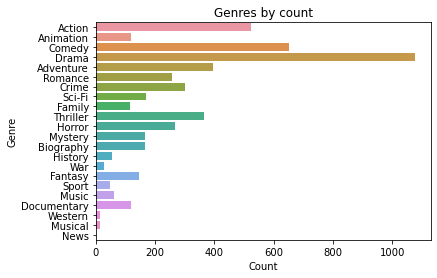
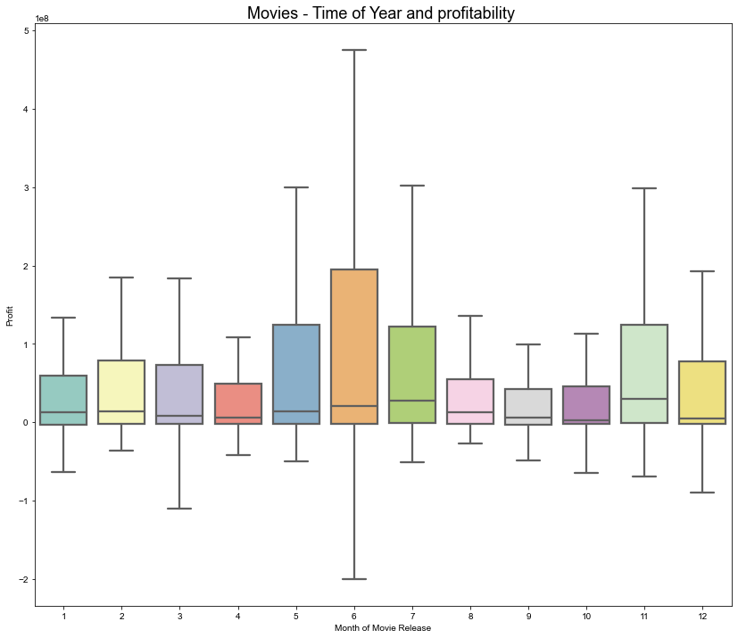
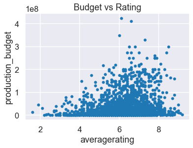

# Microsoft Movie Analysis - Project 1


**Author**: Annie Liu

## Overview

Microsoft wish to create a new movie studio but have limited knowledge about creating movies. This project analyses different types of movie genres, seasonal profitability, and budget vs ratings. 
From this, we put forward the following recommendations to Microsoft to consider when producing movies:

* By categorizing each genre by count, Microsoft can consider producing Drama films which appear to be most popular, followed by Comedy and Action.

* Microsoft can consider producing movies during these periods; mid-year and November (as they yield highest profitability).

* By comparing budget and average ratings there is some correlation where higher budgets can return higher average ratings.   

## Business Problem

Due to Microsoft having limited knowledge of the movie industry, we ask the following questions to help us solve the business problem for Microsoft.

***
Questions considered:
* What are the business's pain points related to this project?

Microsoft unfamiliar with movie industry and therefore unsure of what types of movies to produce. We look at movie characteristics such as genre, financials and ratings to aid us in solving this.

* How did you pick the data analysis question(s) that you did?

Genre, financials, and ratings datasets all seem like reasonable factors that could impact the success of a film.

* Why are these questions important from a business perspective?

By answering these questions, Microsoft can make better assumptions on the types of movie genres to produce, when to produce them and how to potentially increase ratings.
***

## Data

Three different datasets (from IMDB and The Numbers) and have been used for this analysis.

***
Questions considered:

* Where did the data come from, and how do they relate to the data analysis questions?

IMBD.title.basics: dataset represents substantial columns/variables which includes; movie title, year, runtime and genres.

IMBD.title.ratings: Additional info such as average rating and number of votes.

TN.movie_budgets: Includes movie release date, budget and gross.

We targeted the following variables; movie (name of the movie), genres (type of genre), averagerating (movie average rating), release_date (movie release date), production_budget (production budget) and worldwide_gross (international revenue).

***

## Methods

Preparation, analysis and modelling the data.

***

Three datasets were imported, merged and dropped irrelevant columns, duplicate columns were also removed.
The genre variable had missing values, this has been filled with the most frequent value from that column. 
Production_budget and worldwide_gross columns were converted from objects to integers.

There are multiple movies with blended movie genres, we split the genres to form a list with only the unique genres and the count for each. 
A bar plot visualization gives us the results of genre popularity from 'Genre by Count in movies', which allows Microsoft to determine which
types of genres they could produce.

From a profitability perspective, despite lacking a variable/column for profit, we determine this by substracting production_budget from 
worldwide_gross. A new 'Profit' column is created and added into a data frame which includes; release_date, worldwide_gross and 
production_budget. This begs the question 'what would profitability look like across different times of the year?’

Another 'release_month' column is created by associating a 'DatetimeIndex' against the release_date. This lists all the release dates by months
in digits i.e. January = 1, February = 2, March = 3 etc. We find the minimum release_date which determines how far back the release date
goes, this gives indication to age and relevancy of the data. The release_month is then grouped by their month and a mean function is
applied returning the average of the remaining columns in each month. This allows us to assess the release months without duplicates.

A boxplot of 'Movies - Time of Year and profitability' highlights the fluctuations on profitability across the twelve months in a year.
Microsoft can better assess when they wish to produce movies based on seasonality, they can also further question why certain months incur
higher profitability i.e. Is it during school holidays, festive seasons etc?

Finally, we reviewed average rating and wondered if there might be any correlation to production_budget i.e. Can a higher budget present higher
rating score? The averagerating is sorted in ascending order to allow visibility of the range we are working with. A scatter plot will help
visualize the spread, however, the immense data has created a very dense scatter plot. 

To counter the large dataset, the mean function was applied again (new column created for the new ratings as whole numbers). By grouping the new average rating column, when mapped on a scatter plot the density issue is no longer present. 
There is some correlation between budget and ratings. When budgeting for movies, Microsoft can factor this in as it can drive movie ratings. 
   
***

## Results

Interpreting the results.

***

By interpreting the results, we found that by genre count, drama was exceptionally popular followed by comedy and action. The lowest ranking was Western, Musical and War.

When interpreting seasonality, mid-year seems to yield highest profit (particularly in June). November also yields well towards end of the year.

Budget vs ratings whilst not a perfect correlation, the scatter chart certainly indicates a relatively strong relationship and therefore we generalize that a movie budget can influence it's rating score.

Our generalizations have good grounding based off the data we have and therefore can aid to enabling Microsoft to determine their areas of interest. There is a mammoth amount of data (as it has been extracted from the past 10 years). 
By analysing data from the past 10 years, it provides us with more viable insights than if it were only past couple of years. We have used data that had minimal duplicates and missing values to avoid skewing the data. We still had an overwhelmingly large dataset which produced very dense visualizations. 
Only under this circumstance did we aggregate data with an average to help us better visualize trends. 

***

Here is an example of how to embed images from your sub-folder:

### Visualizations


Genre popularity (by count)


Seasonal profitability


Budget vs Rating (large data)


Budget vs Rating (mean data)


## Conclusions

The business problem is very broad at this stage. To determine what movies to produce, we need to determine what Microsoft defines as movies they would want to produce. In this analysis we made broad some initial assumptions to help define our questions and find our answers. 
Whilst we can generalize that drama seems to be the most popular genre produced, there are many other factors which can contribute to the data. For example, why are drama movies most produced? We are uncertain at this stage, therefore we cannot generalize for example that drama movies would then produce good return for Microsoft. Perhaps drama films might have influence on number of votes and therefore creates more hype or publicity with more viewers engaging with these types of movies. 
These are hypothetical assumptions, we would require further analysis.

From the results in our analysis, we recommend the following:

### Recommendation 1

Produce drama, comedy and/or action omovies.

### Recommendation 2

Release movies around between May and July (or November towards end of the year) as it yields higher profitability.

### Recommendation 3

Increase movie budgets for better ratings.


#### Next Steps

There could be other variables that Microsoft would be interested in understanding to better establish the types of movies to produce. 

For instance, analysing from a local perspective, whilst these results are worldwide data, local data might produce different results.  
Microsoft might also want to determine the types of studios and Directors/team that they would want on their production. These are all factors that can influence our current data. Microsoft should take into account that this was an international analysis (as Microsoft is an international company).
Having a bigger picture of the landscape, we can drill down further. It would also be interesting to assess if there is any correlation between genre and num votes or what drives number of votes?

***

## For More Information

Please review our full analysis in [our Jupyter Notebook](./Microsoft-Movie-Analysis.ipynb) or our [presentation](./Microsoft-Movie-Analysis_AL-Presentation.pdf).

For any additional questions, please contact **Annie Liu at annieliu1989@yahoo.com**

## Repository Structure

Describe the structure of your repository and its contents, for example:

```
├── data                	           
├── images   				     
├── Microsoft-Movie-Analysis.ipnb                       
├── Microsoft-Movie-Analysis_Presentation.pdf     
├── notebook.pdf                	
├── github.pdf				        
├── README.md                        
```
                        	